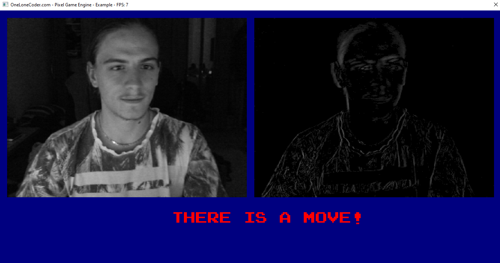
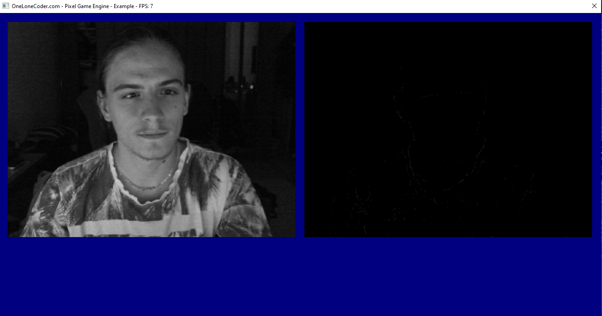

# Sensor_Of_Move
Little project with escapi library and image processing in C++.

When you will open this project in Visual Studio 2019, you must connect webcam to you PC and set Debug x64 profile.

Application captured move!.

Application can't capture move!.

